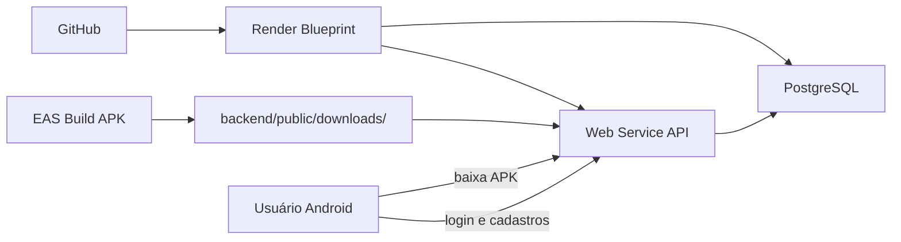

# Deploy no Render — App Schollar

Guia para publicar o **PostgreSQL**, a **API Node.js** e disponibilizar o **APK Android** para download.

## Visão geral

| Componente | Onde roda | Função |
|---|---|---|
| PostgreSQL | Render (banco gerenciado) | Dados de alunos, professores, notas, login |
| API (`backend/`) | Render (Web Service) | REST em `/api` + página de download |
| App mobile | APK instalado no celular | Consome a API publicada |

Fluxo recomendado:



---

## Parte 1 — Subir banco e servidor no Render

### Pré-requisitos

- Conta em [render.com](https://render.com)
- Repositório no GitHub ou GitLab com este projeto

### Opção A — Blueprint (recomendado)

O arquivo [`render.yaml`](../render.yaml) na raiz já define banco + API.

1. Faça **push** do código para o GitHub/GitLab.
2. No Render: **New → Blueprint**.
3. Conecte o repositório e confirme a criação dos recursos:
   - `schollar-db` (PostgreSQL)
   - `app-schollar-api` (Web Service Node)
4. Aguarde o deploy. O script `backend/scripts/setup-db.js` cria as tabelas e insere dados iniciais na primeira execução.
5. Anote a URL pública, por exemplo: `https://app-schollar-api.onrender.com`

### Opção B — Manual

Se preferir criar serviços um a um:

**Banco PostgreSQL**

1. **New → PostgreSQL**
2. Nome: `schollar-db`, plano Free
3. Copie a **Internal Database URL** ou **External Database URL**

**Web Service**

1. **New → Web Service**
2. Conecte o repositório
3. Configurações:
   - **Root Directory:** `backend`
   - **Build Command:** `npm install`
   - **Start Command:** `node scripts/setup-db.js && npm start`
   - **Health Check Path:** `/health`
4. Variáveis de ambiente:

| Variável | Valor |
|---|---|
| `NODE_ENV` | `production` |
| `PGSSL` | `true` |
| `DATABASE_URL` | URL do PostgreSQL do Render |
| `JWT_SECRET` | string longa e aleatória |
| `VIACEP_BASE_URL` | `https://viacep.com.br/ws` |
| `IBGE_BASE_URL` | `https://servicodados.ibge.gov.br/api/v1/localidades` |

### Validar o deploy

Abra no navegador:

- `https://SUA-URL.onrender.com/health` → deve retornar `{"status":"ok",...}`
- `https://SUA-URL.onrender.com/` → página de download do app

Login de demonstração (criado automaticamente no primeiro deploy):

- E-mail: `coordenacao@escola.com`
- Senha: `123456`

> **Plano Free:** o serviço “dorme” após inatividade. A primeira requisição pode levar ~30–60 s.

---

## Parte 2 — Gerar o APK apontando para a API no Render

O app mobile é Expo/React Native. Para distribuir um `.apk` instalável, use o **EAS Build**.

### Pré-requisitos

- Conta Expo: [expo.dev](https://expo.dev)
- EAS CLI: `npm install -g eas-cli`

### Passos

1. Entre na pasta do app:

```bash
cd app_schollar
npm install
eas login
eas build:configure
```

2. Edite `eas.json` e substitua a URL placeholder pela URL real do Render:

```json
"EXPO_PUBLIC_API_BASE_URL": "https://app-schollar-api.onrender.com"
```

3. Gere o APK:

```bash
eas build -p android --profile preview
```

Ou para produção:

```bash
eas build -p android --profile production
```

4. Quando o build terminar, baixe o `.apk` pelo painel da Expo ou pelo link do terminal.

---

## Parte 3 — Disponibilizar o APK para download

A API serve uma página em `/` e o arquivo em `/downloads/app-schollar.apk`.

### Publicar o APK

1. Renomeie o arquivo baixado do EAS para `app-schollar.apk`.
2. Coloque em:

```
backend/public/downloads/app-schollar.apk
```

3. Faça commit e push (ou redeploy no Render):

```bash
git add backend/public/downloads/app-schollar.apk
git commit -m "Publica APK do App Schollar"
git push
```

4. Usuários acessam:

```
https://SUA-URL.onrender.com/
```

e clicam em **Baixar APK (Android)**.

> No Android, é necessário permitir “Instalar apps de fontes desconhecidas” para APKs fora da Play Store.

### Alternativa sem commit do APK

Você também pode enviar o link direto do EAS Build (Expo gera URL temporária) ou usar GitHub Releases. A página em `/` é a opção mais simples para o projeto acadêmico.

---

## Parte 4 — Checklist final

- [ ] PostgreSQL criado no Render
- [ ] Web Service online (`/health` responde)
- [ ] Login `coordenacao@escola.com` funciona via app ou Postman
- [ ] `eas.json` com URL correta do Render
- [ ] APK gerado e colocado em `backend/public/downloads/`
- [ ] Página `/` permite download do APK
- [ ] App instalado no celular conecta à API (não usa `localhost`)

---

## Solução de problemas

**Erro de SSL no banco**

Confirme `PGSSL=true` no Render. O código já habilita SSL em produção.

**API retorna 404 no APK**

O arquivo ainda não foi publicado em `backend/public/downloads/app-schollar.apk`.

**App não conecta no celular**

Verifique se o APK foi gerado **depois** de configurar `EXPO_PUBLIC_API_BASE_URL` com a URL do Render. APKs antigos ainda apontam para `localhost`.

**Quero resetar os dados do banco**

No Render, adicione temporariamente `RUN_SEED=true` nas variáveis de ambiente e faça redeploy. Remova depois para não apagar dados a cada restart.

**CORS**

O backend usa `cors()` aberto. Para produção restrita, ajuste em `backend/server.js`.

---

## Arquivos relevantes

- [`render.yaml`](../render.yaml) — Blueprint Render
- [`backend/scripts/setup-db.js`](../backend/scripts/setup-db.js) — Schema + seed inicial
- [`backend/public/index.html`](../backend/public/index.html) — Página de download
- [`app_schollar/eas.json`](./eas.json) — Build Android
- [`app_schollar/app.config.js`](./app.config.js) — URL da API no build
